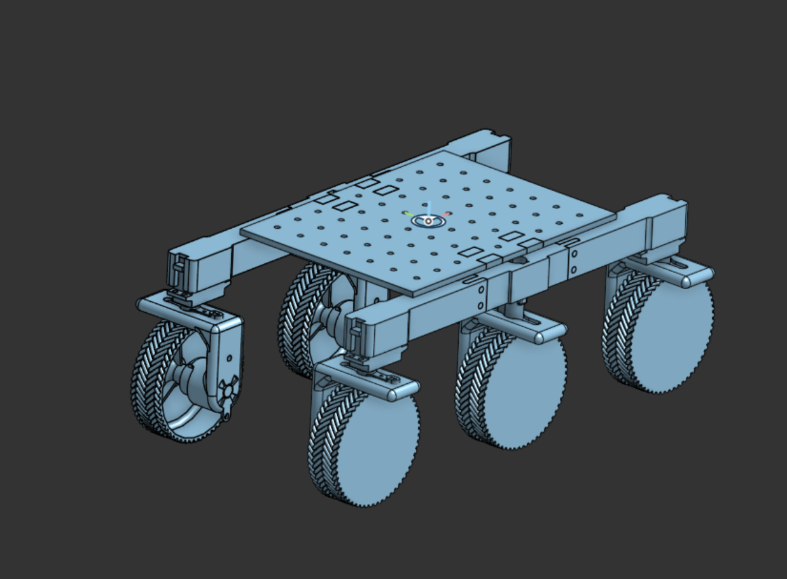
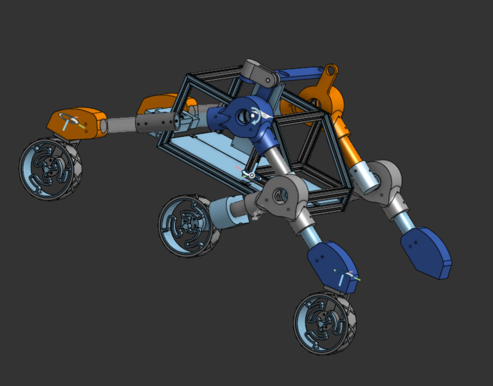
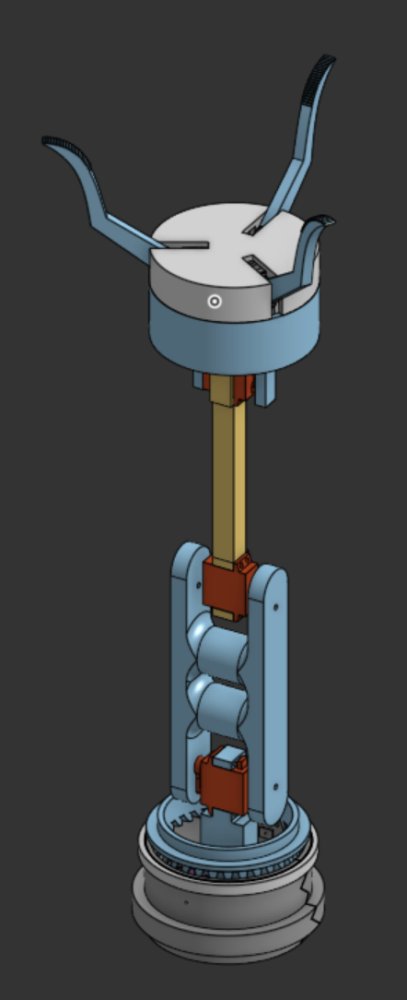

# MANSED's MARS Rover Project!

## Our Goal

Our mission is to build innovative rovers to excel in competitions like the ERC and UKSEDs, creating a community where students can develop real-world engineering and teamwork skills.

## Our Progress

### The Prototype

This was an initial realisation of an idea to something that functions on purely on basic materials, stripped bare of any bells and whistles. This model was powered up by individual servos that can spin each wheel as well as high torque low speed drive motors controlled by an arduino. We were able to display the wireless capabilities in even an early model using the Raspberry Pi 4.

  
  

### V1 - present

This is fully featured and polished model that we hope to present to raise funds for the final rover. This model is due to be 3D printed and finished by the end of 2025, and features:

- Rocker-bogie suspension
- Robotic arm capable of basic movement
- On-board camera capable of streaming to a laptop

The goal of this design is to have something that can be scaled into the final competiton version, with proper metal parts.

  
  

## Meet the team

  

<!--

**Here are some ideas to get you started:**

🙋‍♀️ A short introduction - what is your organization all about?
🌈 Contribution guidelines - how can the community get involved?
👩‍💻 Useful resources - where can the community find your docs? Is there anything else the community should know?
🍿 Fun facts - what does your team eat for breakfast?
🧙 Remember, you can do mighty things with the power of [Markdown](https://docs.github.com/github/writing-on-github/getting-started-with-writing-and-formatting-on-github/basic-writing-and-formatting-syntax)
-->
